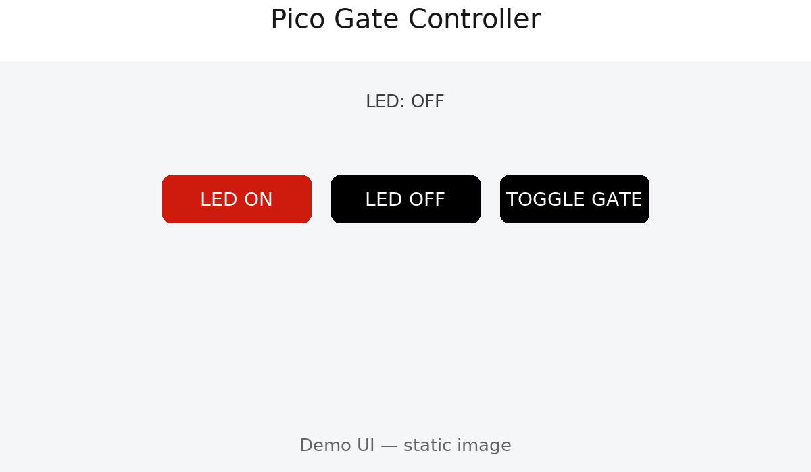

# Pico Gate Controller (Raspberry Pi Pico W, MicroPython)

A lightweight web server that runs on a **Raspberry Pi Pico W** to toggle a relay switch.

For my purposes, the relay switch is soldered to a 433Mhz gate controller to close the switch and simulate a physical button press.
---

## Features

- Minimal HTTP server with routes:
  - `/` – simple UI page
  - `/led_on`, `/led_off` – onboard LED control
  - `/toggle_gate` – pulse a relay (GPIO 20 by default) for 1s
- No external CSS/JS dependencies — small footprint for MicroPython

---

## Hardware

- **Raspberry Pi Pico W**
- Relay module connected to **GPIO 20** (adjustable in `main.py`)
- 3.3V logic — ensure your relay board is compatible


---

## Demo



> Prefer something interactive? Open the static demo page: [`docs/demo.html`](docs/demo.html)

---

## Setup

### 1. Flash MicroPython
Flash the official [MicroPython firmware](https://micropython.org/download/rp2-pico-w/) to your Pico W using the Raspberry Pi instructions.

### 2. Clone this repository
```bash
git clone https://github.com/<your-username>/pico-gate-controller.git
cd pico-gate-controller
```

### 3. Create your secrets
Copy the example file:
```bash
cp src/secrets.example.py src/secrets.py
```

Edit `src/secrets.py` with your details:
```python
WIFI_SSID = "YourWiFi"
WIFI_PASSWORD = "YourPassword"

```

⚠️ **Important**:  
- `src/secrets.py` is `.gitignore`’d — never commit your real passwords.

### 4. Upload to Pico W
You need `main.py`, `utils.py`, and your `secrets.py` on the board.  

With `mpremote`:
```bash
# Upload main file
mpremote cp src/main.py :/main.py

# Upload helper module
mpremote cp src/utils.py :/utils.py

# Upload your personal secrets (do not share this file)
mpremote cp src/secrets.py :/secrets.py
```

> ✅ **Tip**: You can also put helper modules inside `/lib/` if you prefer:
> ```bash
> mpremote cp src/utils.py :/lib/utils.py
> ```

### 5. Reboot and check
- Reboot
- Open the serial console — you should see Wi-Fi connect logs and the Pico’s IP address.  
- Visit `http://<pico-ip>/ in a browser.  
```

---

## Security Notes

- No TLS, no strong authentication.
- Use only on private LANs or behind a VPN / reverse proxy (Tailscale, Cloudflare Tunnel).
- Never expose directly to the internet.

---

## Home Assistant Integration

You can call the Pico endpoints from Home Assistant using `rest_command`, then wrap them in a `script` and trigger them via an `automation` or UI button.

### 1) REST Commands (`configuration.yaml`)

```yaml
rest_command:
  pico_toggle_gate:
    url: "http://PICO_IP/toggle_gate"
    method: get

  pico_led_on:
    url: "http://PICO_IP/led_on"
    method: get

  pico_led_off:
    url: "http://PICO_IP/led_off"
    method: get
```

> Replace `PICO_IP` with the IP printed in the Pico serial logs (e.g., `192.168.1.123`).

### 2) Scripts (`configuration.yaml` or `scripts.yaml`)

```yaml
script:
  toggle_gate:
    alias: Toggle Gate
    mode: single
    sequence:
      - service: rest_command.pico_toggle_gate
```

### 3) Automations (`automations.yaml`)

Example: Open the gate when a specific person arrives home.
Can be integrated with sensor that checks if the gate is open or closed

```

### 4) Lovelace Buttons (UI)

Add a **Button** card and call the script on tap:

```yaml
type: button
name: Toggle Gate
icon: mdi:gate-open
tap_action:
  action: call-service
  service: script.toggle_gate
```

**Notes**

- Home Assistant must be able to reach the Pico’s IP (same LAN/VLAN).
- If you use VLANs or firewalls, allow outbound HTTP (port 80) from Home Assistant to the Pico IP.
- The Pico server is HTTP only (no TLS). Don’t expose it directly to the internet.

## License

MIT — see [LICENSE](./LICENSE).
