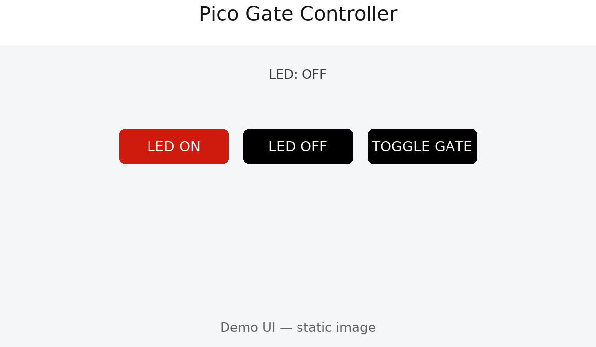
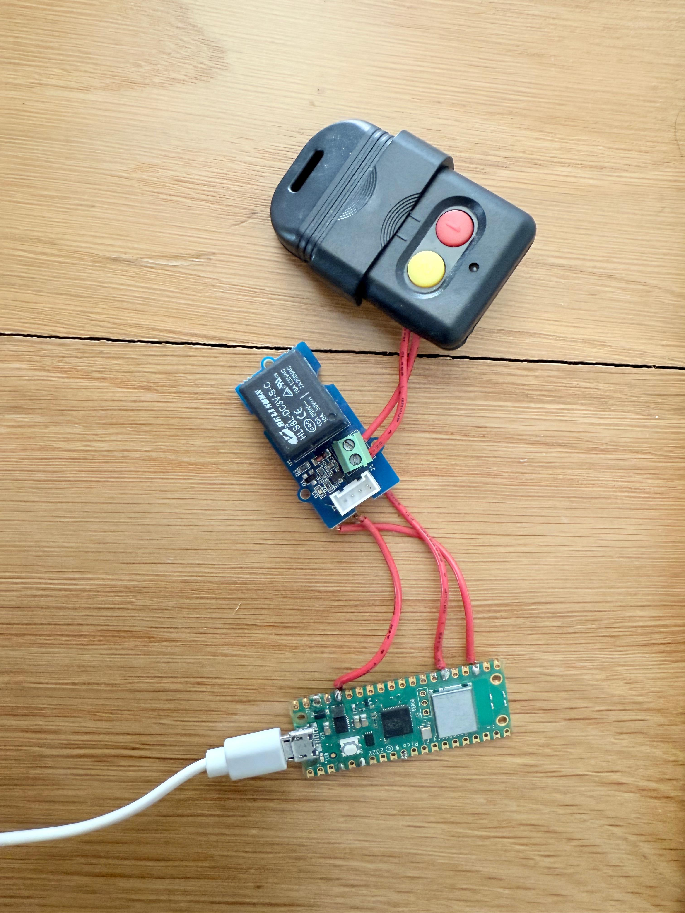

# Pico Pi Powered Garage or Gate Controller

Raspberry Pico Pi W to Trigger a 330 MHz Gate/Garage Controller via a Relay Switch

- A lightweight web server on a **Pi Pico W** to toggle a relay switch.
- Easily integrated into Home Assistant to work with sensors, automations and scripts
- For my purposes, the relay switch is soldered to a 330Mhz gate controller to close the switch and simulate a physical button press.

---

## Features

- Minimal HTTP server with routes:
  - `/` – simple UI page
  - `/led_on`, `/led_off` – onboard LED control, I used this to make sure everything was working before soldering the relay to the Pico Pi
  - `/toggle_gate` – pulse a relay for 1s (**GPIO 20** by default, but you can tweak this in the code) 

---

## Hardware

- **Raspberry Pi Pico W**
- **1-channel Relay Switch**
- **330MHz (or 433MHz) Gate Controller, or really any other similar remote**
- Connect the Gate Controller to the Relay Module, and the Relay Module to **GPIO 20** of the Pico Pi (adjustable in `main.py`)
---

## Demo



---

## Setup

### 1. Flash MicroPython
Flash the official [MicroPython firmware](https://micropython.org/download/rp2-pico-w/) to your Pico Pi W using the Raspberry Pi instructions.

### 2. Clone this repository
```bash
git clone https://github.com/markbala/pico-gate-controller
cd pico-gate-controller
```

### 3. Input WiFi Credentials, save a secrets.py file
Copy the example file:
```bash
cp src/secrets.example.py src/secrets.py
```

Edit `src/secrets.py` with your details:
```python
WIFI_SSID = "YourWiFi"
WIFI_PASSWORD = "YourPassword"

```

⚠️ **Important**:  
- `src/secrets.py` is `.gitignore`’d — never commit your real passwords.

### 4. Upload to Pico W
Use Thonny to upload the src folder (or just these 3 scripts) `main.py`, `utils.py`, and your `secrets.py` onto the board.  


### 5. Reboot. Script will run automatically upon boot
- Reboot
- Identify the IP address of the Pico Pi W through your router.  
- Visit `http://<pico-ip>/` in a browser. Should be a local IP, e.g.`http://192.168.x.x`  
- Set a fixed IP for this device for convenience thereafter.

## Security Notes

- Use exclusively on private LANs or behind a VPN / reverse proxy (Tailscale, Cloudflare Tunnel).
- Never expose directly to the internet.

---

## 6. Home Assistant Integration

You can call the Pico endpoints from Home Assistant using `rest_command`, then wrap them in a `script` and trigger them via an `automation` or UI button.

### 1) REST Commands (`configuration.yaml`)

```yaml
rest_command:
  pico_toggle_gate:
    url: "http://PICO_IP/toggle_gate"
    method: get
```

> Replace `PICO_IP` with the IP printed in the Pico serial logs (e.g., `192.168.1.123`).

### 2) Scripts (`configuration.yaml` or `scripts.yaml`)

```yaml
script:
  toggle_gate:
    alias: Toggle Gate
    mode: single
    sequence:
      - service: rest_command.pico_toggle_gate
```

### 3) Automations

Example: Open the gate when a specific person arrives home.
Can be integrated with sensor that checks if the gate is open or closed

### 4) Lovelace Buttons (UI)

Add a **Button** card and call the script on tap:

```yaml
type: button
name: Toggle Gate
icon: mdi:gate-open
tap_action:
  action: call-service
  service: script.toggle_gate
```

**Notes**

- Home Assistant must be able to reach the Pico’s IP (same LAN/VLAN).
- If you use VLANs or firewalls, allow outbound HTTP (port 80) from Home Assistant to the Pico IP.
- The Pico server is HTTP only (no TLS). Don’t expose it directly to the internet.

## License

MIT — see [LICENSE](./LICENSE).

## Credits

Initial code by Vivian Balakrishnan
Adapted for everyday use by Mark Balakrishnan
